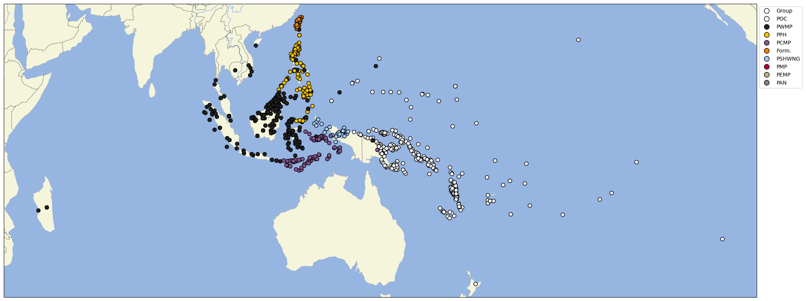

# Austronesian Comparative Dictionary

## How to cite

If you use these data please cite
this dataset using the DOI of the [particular released version](../../releases/) you were using

## Description

This dataset is licensed under a CC-BY-4.0 license

## Notes

> The goal of this work is to create a comparative dictionary […] as the primary source of historical data on the entire Austronesian language family.

- [ABOUT.md](ABOUT.md) provides the introduction to the legacy online version of the ACD at 
  https://trussel2.com/ACD/ formatted as markdown document.
- [VALIDATION.md](VALIDATION.md) describes how our dataset was validated, in particular with respect
  to completeness and correctness of the conversion from the legacy HTML pages.
- [USAGE.md](USAGE.md) describes tools and techniques which help with using the highly relational
  data of the ACD.

## Statistics

- **Varieties:** 1,063 (linked to 820 different Glottocodes)
- **Concepts:** 86,502 (linked to 0 different Concepticon concept sets)
- **Lexemes:** 146,733
- **Sources:** 454
- **Synonymy:** 1.01
- **Cognacy:** 121,682 cognates in 10,857 cognate sets (5 singletons)
- **Cognate Diversity:** -1.26

## Possible Improvements:

- Entries missing sources: 38249/146733 (26.07%)

# Contributors

Name | GitHub user | Role
--- | --- | ---
Robert Blust |  | author
Stephen Trussel | | author
Robert Forkel | @xrotwang | DataCurator, author
Alexander D. Smith | @The-Austronesianist | author

## CLDF Datasets

The following CLDF datasets are available in [cldf](cldf):

- CLDF [Wordlist](https://github.com/cldf/cldf/tree/master/modules/Wordlist) at [cldf/cldf-metadata.json](cldf/cldf-metadata.json)