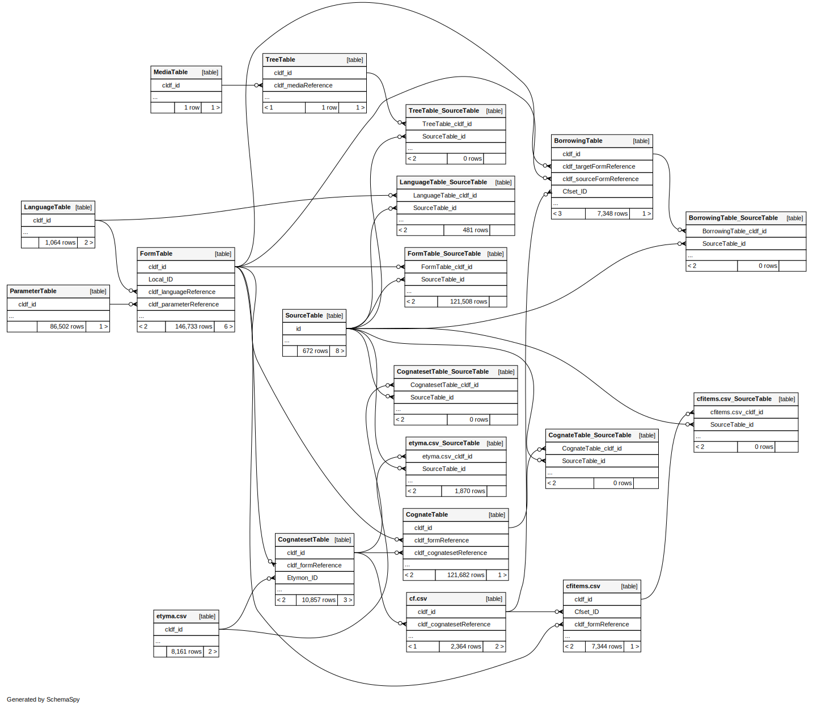

# Using the ACD CLDF data

## Overview

The ACD data is formatted as [cognate-coded CLDF Wordlist](cldf/README.md).
Thus, the [cognate sets](https://acd.clld.org/cognatesets), as familiar from the ACD website, can
be accessed by aggregating data from the
- *CognatesetTable* - reconstructed proto-form and meaning from the *Form* and *Description* columns and a link to the proto-language,
- *CognateTable* - the association table linking forms to cognatesets,
- *FormTable* - the related word forms and links to their language and meaning,
- *ParameterTable* - the word meanings, and
- *LanguageTable*.



Aggregating data across five tables can be somewhat cumbersome, though, without the support of a suitable
computing environment. Thus, we recommend to access the data either using `pycldf` (see below) - if working
in Python - or via a SQLite database created from the CLDF data.


## Using `pycldf`

We can use the [pycldf](https://pypi/project/pycldf) package to access the data programmatically from
within Python programs. Assembling the data of example (1) in Blust and Trussel's Research Note from 2013
could be done as follows:

```python
>>> from pycldf import Dataset
>>> ds = Dataset.from_metadata('cldf/cldf-metadata.json')
>>> for etymon in ds['etyma.csv']:
...     if etymon['Name'] == '*qeCeŋ':
...         break
...        
>>> etymon['ID']
'27713'
```

Now that we know the numeric set ID, we can drill down to the cognate set (keeping in mind that multiple
subsets may be related to the etymon - not in this case, though):

```python
>>> css = [cs for cs in ds['CognatesetTable'] if cs['Etymon_ID'] == etymon['ID']]
>>> len(css)
1
```

For the next step, assembling cognates - and thus related forms and the languages they belong to - we
can exploit the more convenient access to explicit relations implemented in `pycldf`'s `orm` module:

```python
>>> cognates = [cog for cog in ds.objects('CognateTable') if cog.cldf.cognatesetReference == css[0]['ID']]
>>> for cog in cognates:
...     print('{}\t{}\t{}'.format(cog.form.language.cldf.name, cog.form.cldf.value, cog.form.cldf.description))
...     
Proto-Austronesian	*qeCeŋ	obstruction, barrier
Proto-Malayo-Polynesian	*qeteŋ	obstruction, barrier
Paiwan	qetseŋ	barrier, fence, enclosure; a "no entry" sign to humans or evil spirits (e.g. a stick left in certain position in front of house)
Karo Batak	henteŋ	lie athwart, lie across a path
Kayan	teŋ	dam in the river
```


## Using SQLite

Running the above example with `pycldf` was slow (around 40secs). This is because reading through >100,000 rows of typed data
in CSV files takes time, and we have to do that for cognates **and** forms. Each CLDF dataset can be converted
to an SQLite database, though. So we can incur an upfront cost - reading the whole dataset from CSV - and get
very fast lookup thereafter.

So let's go through the example from above again after creating the SQLite database via
```shell
time cldf createdb cldf/ acd.sqlite
INFO    <cldf:v1.0:Wordlist at cldf> loaded in acd.sqlite

real    0m41.425s
user    0m40.110s
sys     0m1.223s
```

We can run SQL queries using the [SQLite command line shell](https://www.sqlite.org/cli.html):

```sql
sqlite> SELECT cldf_id FROM "etyma.csv" WHERE cldf_name = '*qeCeŋ';
27713
sqlite> SELECT cldf_id FROM CognatesetTable WHERE etymon_id = '27713';
27713_1
```
Of course the best feature of SQL in our context is its ability to access data in multiple tables, by 
**JOIN**ing them:
```sql
sqlite> SELECT cs.cldf_id FROM CognatesetTable AS cs JOIN "etyma.csv" AS e ON cs.etymon_id = e.cldf_id WHERE e.cldf_name = '*qeCeŋ';
27713_1
```

From here it's just a couple more JOINs to get to a query as follows:
```sql
SELECT language.cldf_name, form.cldf_value, form.cldf_description 
  FROM FormTable AS form 
  JOIN LanguageTable AS language 
    ON form.cldf_languageReference = language.cldf_id 
  JOIN CognateTable AS cognate 
    ON cognate.cldf_formReference = form.cldf_id 
  JOIN CognatesetTable AS cognateset 
    ON cognate.cldf_cognatesetReference = cognateset.cldf_id 
  JOIN "etyma.csv" AS etymon
    ON cognateset.etymon_id = etymon.cldf_id 
 WHERE etymon.cldf_name = '*qeCeŋ';
```
which can be put into a file `27713.sql` and run on the database as
```shell
$ time sqlite3 acd.sqlite -separator $'\t' < 27713.sql 
Proto-Austronesian      *qeCeŋ  obstruction, barrier
Proto-Malayo-Polynesian *qeteŋ  obstruction, barrier
Paiwan  qetseŋ  barrier, fence, enclosure; a "no entry" sign to humans or evil spirits (e.g. a stick left in certain position in front of house)
Karo Batak      henteŋ  lie athwart, lie across a path
Kayan   teŋ     dam in the river

real    0m0.168s
user    0m0.144s
sys     0m0.024s
```
