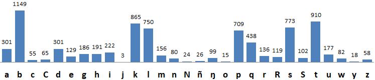
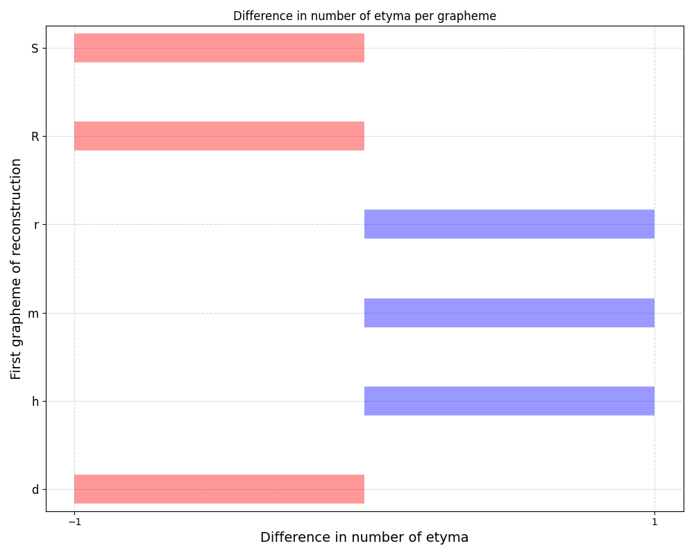
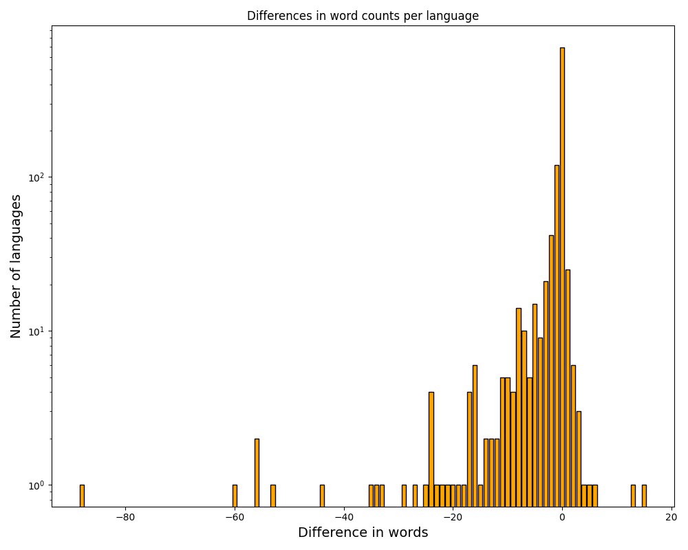
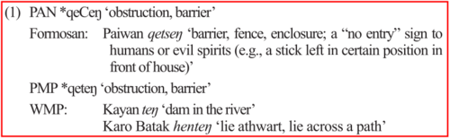
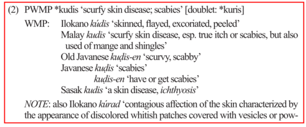
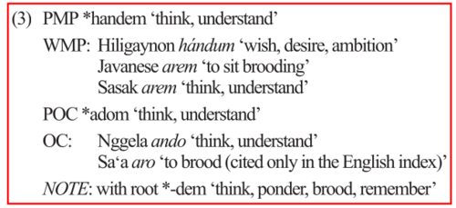
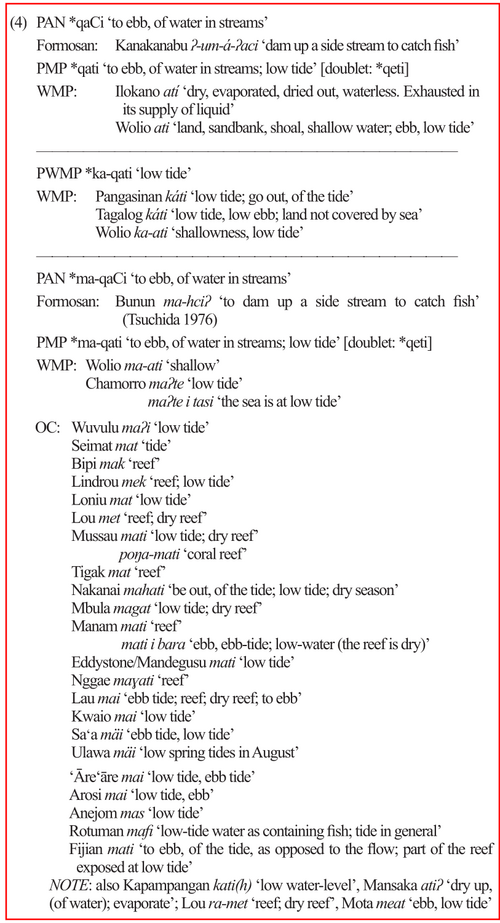

# Validating the ACD dataset'

## Completeness

By far the mojority of the data in this dataset was extracted from the legacy online version at https://trussel2.com/ACD/ .
To assess the completeness of this extraction, two sets of numbers are available for comparison.


### The number of cognate sets per initial grapheme

The legacy HTML pages list the numbers of cognate sets as follows:



Recomputing such numbers for the current dataset is simple. Running
```
$ sqlite3 acd.sqlite 'select initial, count(cldf_id) from "etyma.csv" group by initial order by lower(initial)' -separator , | grep termgraph
```
we get
```
a: ▇▇▇▇▇▇▇▇▇▇▇▇▇ 321.00
b: ▇▇▇▇▇▇▇▇▇▇▇▇▇▇▇▇▇▇▇▇▇▇▇▇▇▇▇▇▇▇▇▇▇▇▇▇▇▇▇▇▇▇▇▇▇▇▇▇▇▇ 1.15 K
C: ▇▇ 65.00
c: ▇▇ 55.00
d: ▇▇▇▇▇▇▇▇▇▇▇▇▇ 300.00
e: ▇▇▇▇▇ 129.00
g: ▇▇▇▇▇▇▇▇ 187.00
h: ▇▇▇▇▇▇▇▇ 192.00
i: ▇▇▇▇▇▇▇▇▇ 222.00
j: ▏ 3.00 
k: ▇▇▇▇▇▇▇▇▇▇▇▇▇▇▇▇▇▇▇▇▇▇▇▇▇▇▇▇▇▇▇▇▇▇▇▇▇ 865.00
l: ▇▇▇▇▇▇▇▇▇▇▇▇▇▇▇▇▇▇▇▇▇▇▇▇▇▇▇▇▇▇▇▇ 751.00
m: ▇▇▇▇▇▇ 157.00
N: ▇ 24.00
n: ▇▇▇ 80.00
o: ▏ 15.00
p: ▇▇▇▇▇▇▇▇▇▇▇▇▇▇▇▇▇▇▇▇▇▇▇▇▇▇▇▇▇▇ 709.00
q: ▇▇▇▇▇▇▇▇▇▇▇▇▇▇▇▇▇▇▇ 438.00
R: ▇▇▇▇▇ 118.00
r: ▇▇▇▇▇ 137.00
S: ▇▇▇▇ 101.00
s: ▇▇▇▇▇▇▇▇▇▇▇▇▇▇▇▇▇▇▇▇▇▇▇▇▇▇▇▇▇▇▇▇▇ 773.00
t: ▇▇▇▇▇▇▇▇▇▇▇▇▇▇▇▇▇▇▇▇▇▇▇▇▇▇▇▇▇▇▇▇▇▇▇▇▇▇▇ 910.00
u: ▇▇▇▇▇▇▇ 177.00
w: ▇▇▇ 82.00
y: ▏ 18.00
z: ▇▇ 58.00
ñ: ▇ 26.00
ŋ: ▇▇▇▇ 99.00
```

If we recompute these numbers for the current dataset and adjust them according to the 22 sets added between
v1.0 and v.1.2, we get the following minimal differences for six initials:




### The number of word forms per language 

These numbers are listed on the pages under [Languages](https://trussel2.com/ACD/acd-l_a.htm).
When extracting the data we have identified words when they had same form and meaning description, 
and split forms in cases when multiple forms were listed in one entry, split by ",". Thus, differences
in both directions between the old and the current numbers are expected to some degree. Still, for the
majority of languages we get (near) identical numbers:




## Correctness

To validate our CLDF dataset, we recreate the examples cited in 'The Austronesian Comparative Dictionary: A Work in Progress'
(published as Research Note in Oceanic Linguistics in 2013)
thereby illustrating that our extraction of the legacy data fromt the HTML pages at https://trussel2.com/ACD/ was accurate.
It should be noted that the research note describes the status of the ACD as of 2013, with a "current total" of 4,837 cognate
sets, whereas in 2020 -- the state represented at https://trussel2.com/ACD/ -- it contained more than 8,000 sets. Thus, a lot
of work went into the dictionary after 2013, but we should expect the majority of this work being additions rather than removal
or correction of content.

Recreation of cognate sets in the visual form presented in the research note (which served also as a template for the
HTML representation at https://trussel2.com/ACD/) is done via a `cldfbench` subcommand [`acd.etymon`](acdcommands/etymon.py),
distributed with our dataset.


## Example 1:



Running
```shell
cldfbench acd.etymon qeCeŋ --with-reconstruction-tree
```
we get
```
         ┌─
──*qeCeŋ─┤
         │        ┌─────── ──
         └─*qeteŋ─┤
                  │        ┌─
                  └────────┤
                           │        ┌─
                           └────────┤
                                    └─
PAN *qeCeŋ ‘obstruction, barrier’ 
  Form.
	Paiwan	qetseŋ	‘barrier, fence, enclosure; a "no entry" sign to humans or evil spirits (e.g. a stick left in certain position in front of house)’
PMP *qeteŋ ‘obstruction, barrier’ 
  WMP
	Karo Batak	henteŋ	‘lie athwart, lie across a path’
	Kayan	teŋ	‘dam in the river’

```
> [!NOTE]
> Our dataset also contains the topology of the assumed sub-group tree underlying the reconstructions. Thus,
> we can plot the reconstruction at each level on this tree, providing a visualization of the postulated
> sound changes.


## Example 2:



Running
```shell
cldfbench acd.etymon kudis
```
we get
```
PAN *kudis ‘scurfy skin disease; scabies’ [doublet: *kuris₁]
  Form.
	Amis	kodic	‘mange; skin disease’
  WMP
	Malay	kudis	‘scurfy skin disease, esp. true itch or Scabies, but also used of mange and shingles’
	Old Javanese	kuḍis-en	‘scurvy, scabby’
	Javanese	kuḍis	‘scabies’
	Javanese	kuḍis-en	‘have or get scabies’
	Sasak	kudis	‘a skin disease (ichthyosis)’
  PH
	Ilokano	kúdis	‘skinned, flayed, excoriated, peeled’

NOTE: Also Ilokano kúrad ‘contagious affection of the skin characterized by the appearance of discolored whitish patches covered with vesicles or powdery scales, and at times itching greatly; a kind of tetter or ringworm’, Karo Batak kudil ‘scabies’, kudil-en ‘suffer from scabies’, Javanese kuḍas ‘ringworm’, Sasak kurék ‘scabies, itch’.

```

> [!NOTE]
> Due that due to inclusion of Formosan evidence (between 2013 and 2020), *kudis is now reconstructed to PAN.


## Example 3:



Running
```shell
cldfbench acd.etymon handem
```
we get
```
PMP *handem ‘think, understand’ 
  WMP
	Javanese	arem	‘to sit brooding’
	Sasak	arem	‘think, understand’
  PH
	Hiligaynon	hándum	‘wish, desire, ambition’
POC *adom ‘think, understand’ 
  OC
	Nggela	ando	‘think, understand’
	Sa'a	aro	‘to brood (cited only in the English index)’

NOTE: With root *-dem ‘think, ponder, brood, remember’.

```

> [!NOTE]
> At some point after 2013 an explicit Philippine subgroup has been added to the ACD.


## Example 4:



Running
```shell
cldfbench acd.etymon qaCi
```
we get
```
PAN *qaCi ‘ebb, of water in streams’ 
  Form.
	Kanakanabu	ʔ-um-á-ʔaci	‘dam up a side stream to catch fish’
PMP *qati ‘ebb, of water in streams; low tide’ [doublet: *qeti]
  WMP
	Wolio	ati	‘land, sandbank, shoal, shallow water; ebb, low tide’
  PH
	Yami	aci	‘dry, dry up (as a stream)’
	Ilokano	atí	‘dry, evaporated, dried out, waterless. Exhausted in its supply of liquid’
---
PWMP *ka-qati ‘low tide’ 
  WMP
	Wolio	ka-ati	‘shallowness, low tide’
  PH
	Pangasinan	káti	‘low tide; go out, of the tide’
	Tagalog	káti	‘low tide, low ebb; land not covered by sea’
---
PAN *ma-qaCi ‘ebb, of water in streams; low tide’ [doublet: *qeti₁]
  Form.
	Bunun	ma-hciʔ	‘dam up a side stream to catch fish (Tsuchida 1976)’
PMP *ma-qati ‘ebb, of water in streams; low tide’ [doublet: *qeti₁]
  WMP
	Chamorro	maʔte	‘low tide’
	Chamorro	maʔte i tasi	‘the sea is at low tide’
	Wolio	ma-ati	‘shallow’
POC *maqati ‘ebb tide, dry reef’ 
  OC
	Wuvulu	maʔi	‘low tide’
	Seimat	mat	‘tide’
	Manam	mati ibara	‘ebb, ebb-tide; low-water (the reef is dry)’
	Manam	mati	‘reef’
	Bipi	mak	‘reef’
	Lindrou	mek	‘reef; low tide’
	Labu	ma	‘shallow place in the water’
	Lou	met	‘reef; dry reef’
	Loniu	mat	‘low tide’
	Mbula	magat	‘low tide; dry reef’
	Vitu	ma-hati	‘reef’
	Mussau	mati	‘low tide; dry reef’
	Mussau	poŋa-mati	‘coral reef’
	Lakalai	mahati	‘be out, of the tide; low tide; dry season’
	Tigak	mat	‘reef’
	Halia	mats	‘low tide’
	Eddystone/Mandegusu	mati	‘low tide’
	Nggae	maɣati	‘reef’
	Lau	mai	‘ebb tide; reef; dry reef; to ebb’
	Kwaio	mai	‘low tide’
	'Āre'āre	mai	‘low-tide, ebb-tide’
	Arosi	mai	‘low tide; ebb’
	Ulawa	mäi	‘low spring tides in August’
	Sa'a	mäi	‘ebb tide, low tide’
	Anejom	mas	‘low tide’
	Rotuman	mafi	‘low-tide water as containing fish; tide in general’
	Fijian	mati	‘to ebb, of the tide, as opposed to the flow; part of the reef exposed at low tide’

NOTE: Also Kapampangan kati(h) ‘low water-level’, Mansaka atiʔ ‘dry up (of water); evaporate’; Lou ramet ‘reef; dry reef’, Mota meat ‘ebb, low tide’.

```


## Miscellaneous

The research note contains several other statements about the contents of the dataset, which we can verify.
We use this verification to also illustrate how to efficiently access the relational data. Since each CLDF
dataset can easily be converted to a SQLite database, we use the SQLite representation and the SQL query
language in the following.

The paper states that

> it should be noted that PAN *aNak ‘child’, which is 15 single-spaced
> pages in print form, is supported by reflexes in 101 languages, and the main entry is fol-
> lowed by 46 subentries, which include prefixed, suffixed, and circumfixed forms of the
> base, prefixed and suffixed forms of the base, partial and full reduplications, and a num-
> ber of compounds, such as PMP *anak apij ‘twin’, PMP *anak bahi/ba-bahi/b<in>ahi
> ‘wife-taking group’, PMP *anak buaq ‘relative’, PWMP *anak daRa ‘virgin, girl of mar-
> riageable age’, PMP *anak ma-Ruqanay/(la)-laki ‘wife-giving group’, PWMP *anak
> haRezan ‘step or rung of a ladder’, PMP *anak i mata ‘pupil of the eye’, and *anak i
> panaq ‘arrow’.

Counting distinct languages of reflexes for a set can be done with the following query:
```sql
select
    count(distinct l.cldf_id) as nlangs 
from 
    languagetable as l
  join formtable as f on f.cldf_languagereference = l.cldf_id 
  join cognatetable as c on f.cldf_id = c.cldf_formreference 
  join cognatesettable as cs on c.cldf_cognatesetreference = cs.cldf_id
  join `etyma.csv` as e on cs.etymon_id = e.cldf_id
where 
    l.is_proto = false and cs.is_main_entry = true and e.cldf_name = '*aNak';
```
resulting in
```
nlangs
147

```
Counting the subsets for an etymon is very simple:
```sql
sqlite> select count(*) from cognatesettable as cs, `etyma.csv` as e where cs.etymon_id = e.cldf_id and e.cldf_name = '*aNak';
48 
```

Testing whether a particular reconstruction is listed for a subset can be done as
```sql
sqlite> select exists(select cs.cldf_name from cognatesettable as cs, `etyma.csv` as e where cs.etymon_id = e.cldf_id and e.cldf_name = '*aNak' and cs.cldf_name like '%*anak apij%');
1
```

